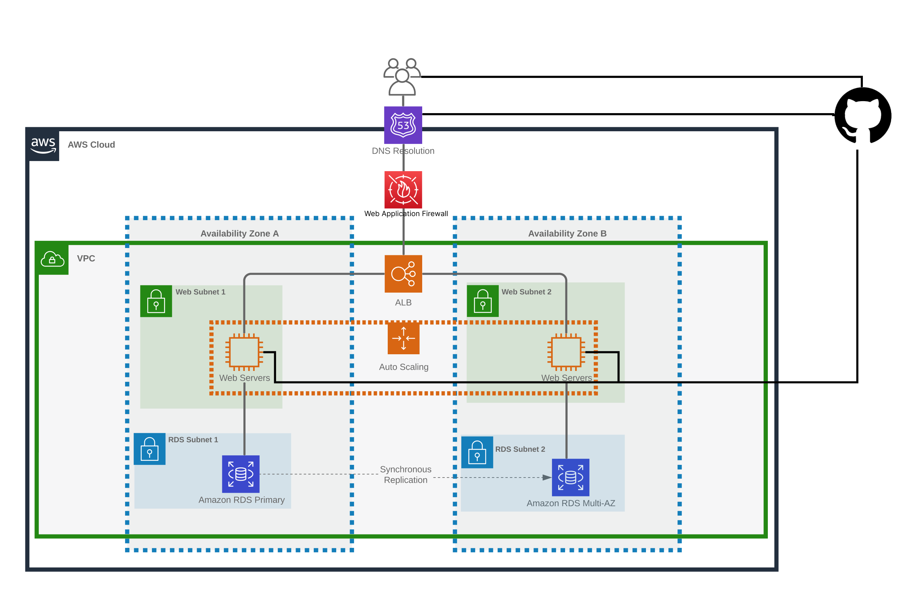
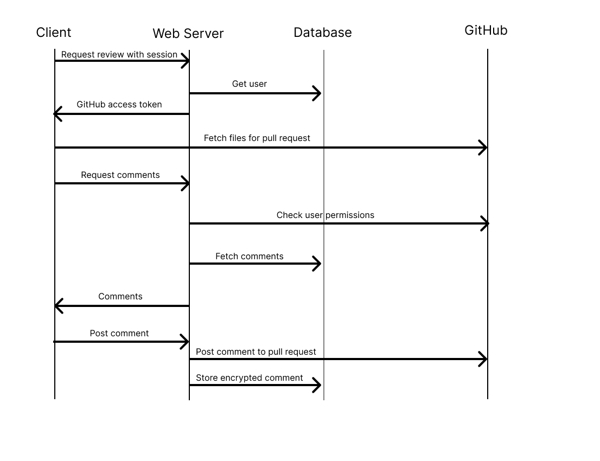

# GitNotebooks Enterprise Security

This page offers an overview of GitNotebooks security-related features. Note that while there are many ways to configure GitNotebooks we'll only discuss the most secure configuration here.

Everything on this page applies to both self-hosted and managed Enterprise instances. A managed instance is just a self-hosted instance that we run for you (outside your VPN), configured as follows:

- GitNotebooks web application servers and image storage run in AWS.
- All secrets are stored in AWS Secret Manager, with audit trails enabled.

## Architecture

This is the recommended architecture for a self-hosted deployment, which is also used for the managed Enterprise instances. The diagram summarizes the various components and how they communicate:

If using GitHub Enterprise Server, the communication to GitHub remains within your VPN. If using a corporate VPN, all communication from the client remains within the VPN, and the Web Application Firewall is unnecessary.

Note: While we replicate the deployment across two Availability Zones for Managed Enterprise accounts, this is not strictly necessary for Self-Hosted.

## Network Security

| Service                   | Inbound                                                        | Outbound                                | Internet-Facing | Internet Access |
| ------------------------- | -------------------------------------------------------------- | --------------------------------------- | --------------- | --------------- |
| Application Load Balancer | TCP:80 (redirect to 443)   TCP:443 GitHub and Corporate VPN | TCP:3000 Web application security group | Yes             | N/A             |
| Web application instance  | TCP:3000 ALB security group                                    | TCP:443 GitHub   TCP:443 Bugsnag     | No              | Yes             |
| RDS Postgres              | TCP:5432 Web application security group                        | None                                    | No              | No              |

## Data Encryption

**Data Encyption At Rest**

There are two pieces of sensitive data stored by the application. Both are AES encypted at rest:

- GitHub Auth Tokens
- Comment Body

In the case of self-hosted, the encyption key is generated by you. It's recommended that this key be stored in a secrets manager and mounted into the container image by reference.

**Data Encyption in Transit**

For Managed Enterprise accounts, the following components use TLS encyption:

- Application Load Balancer
- Database
- GitHub Enterprise

It is recommended that network traffic be encrypted similarly for self-hosted deployments.

## Authentication

GitNotebooks relies entirely on GitHub Enterprise (GHE) for authentication. If you've configured your GHE instance to use SSO via SAML then GitNotebooks will use that too. There are no separate local user accounts to maintain within Gitnotebooks.

When a user signs in, GitNotebooks obtains and stores an OAuth token that lets it operatore on the user's behalf within the scopes that were granted. GitNotebooks needs the following scopes:

- Repo (read and write)
- Pull requests (write)
- Metadata (read and write)

## Authorization

Authorizations in GitNotebooks are inferred from the permissions granted to users in GHE, i.e. repository read/write/admin and organization owner. There are no separate roles or authorizations maintained within GitNotebooks.

## Data Flow

The following diagrams illustrate the two primary workflows of GitNotebooks

## Frequently Asked Questions

**Does the self-hosted application send any network requests to GitNotebooks?**

No, self-hosted installations do not make any network requests apart from those made to GitHub. If hosting GitHub Enterprise Server, all network traffic remains within your VPN. It is recommended that you restrict network requests from the application server to your GitHub Enterprise Cloud environment if you are not self-hosting GitHub.

**Does GitNotebooks have access to any Self Hosted data?**

No, all data is stored within your own cloud environment. GitNotebooks does not have access to any of your data.
