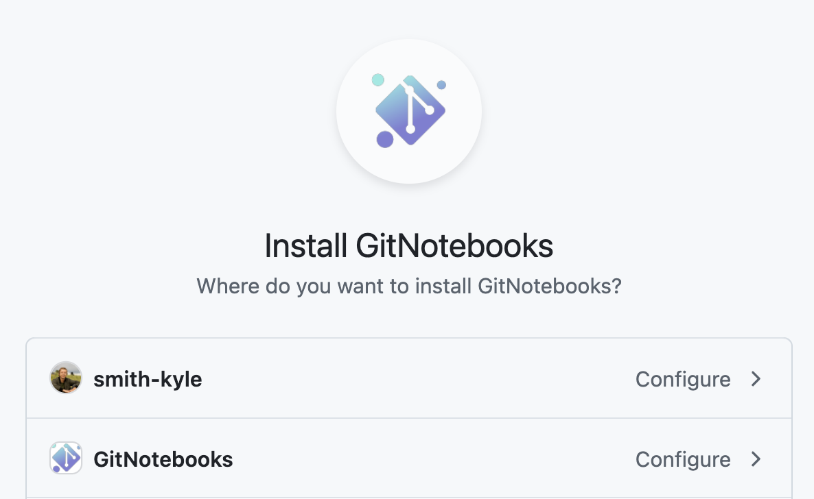

# Getting Started

Welcome to GitNotebooks! Before diving into the installation process, we recommend checking out our demo pull request. This allows you to try GitNotebooks without setting up a repository or installing the app.
👉 <a href="https://app.gitnotebooks.com/GitNotebooks/demo/pull/1" target="_blank">Try our demo pull request</a>

## Installation

Getting GitNotebooks up and running is quick and easy. Follow these simple steps:

1. Sign in to the [GitNotebooks dashboard](https://app.gitnotebooks.com/dashboard)
2. Click `Add Repo`
3. Select the repositories

  

    
Sign in

    
  

  

    
Add Repo

    
  

  

    
Select Repos

    
  

  

    
Start Reviewing

    
  

The entire process takes about a minute!

Can't install GitNotebooks in your GitHub Organization?

You may not have the required permissions to install GitNotebooks. You can ask your
GitHub Organization admin to install GitNotebooks or [request a self-hosted version](https://share.hsforms.com/1KcFTS0dHRPqyMli5Dr8kiwryqe1).

## Review a Notebook

Now that you've installed GitNotebooks, you're ready to start reviewing notebooks. Our [Reviewing a Notebook](./reviewing_a_notebook.md) guide will walk you through the process, showing you how to open pull requests, and make comments on both code and markdown.

## Questions or Feedback

We're here to help! If you need support or have any questions, feel free to reach out to us at `support@gitnotebooks.com`. You can also post an issue to our [public repository](https://github.com/GitNotebooks/GitNotebooks/issues) for feature requests or bug reports.
