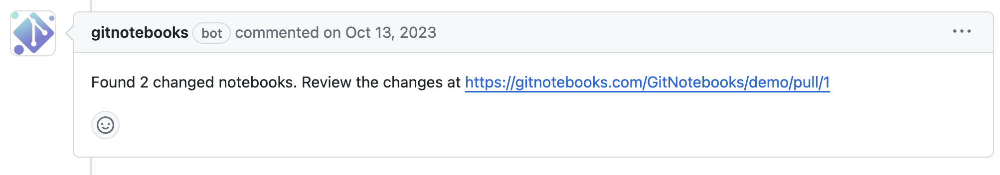
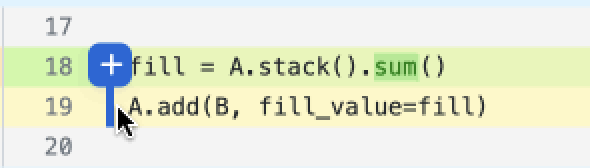
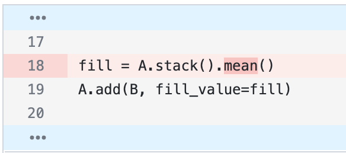
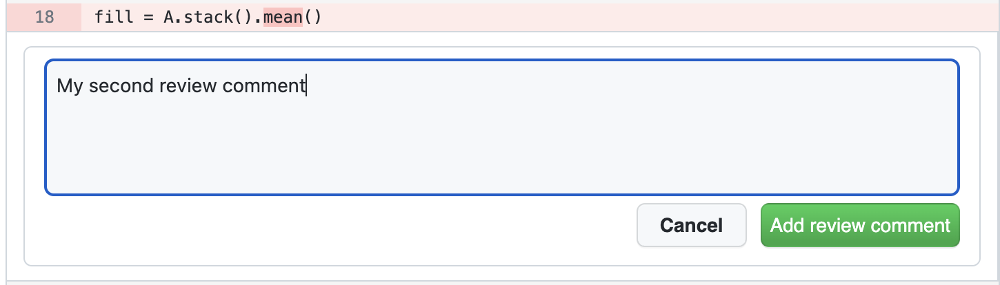

# Reviewing a Notebook

This guide will walk you through the process of reviewing Jupyter notebooks using GitNotebooks. We'll cover how to add comments, understand diffs, and submit reviews.

## Viewing a Notebook Change

When you open a new pull request that includes changes to Jupyter notebooks, GitNotebooks automatically adds a comment to your pull request. This comment contains a link inviting you to review the notebooks using GitNotebooks.

## Adding and Viewing Comments

Once you have opened up a review in GitNotebooks, you can add comments to both code and markdown cells.

### Code Comments

You can add single-line or multi-line comments on either the left or right side of the code.

  

    <h4>Single-line Comment</h4>
    
  

  

    <h4>Multi-line Comment</h4>
    
  

### Markdown Comments

To comment on markdown, simply click directly on the markdown text. Each markdown comment is associated with a specific line in the markdown, ensuring your feedback is always in context.

When a comment is added to markdown, a blue underline will appear. To view the comment and respond, click the markdown or the avatar to the right.

You can view markdown diffs in both rendered and raw formats, giving you the option to review the content in the way that works best for you. To learn more see our [settings docs](./settings.md)

  

    <h4>Adding a markdown comment</h4>
    
  

  

    <h4>Replying to a markdown comment</h4>
    
  

### Notes About Comments

Comments will stay in place as new commits are pushed to the branch.

Comments are automatically marked as outdated if a new commit changes the specific line since the comment was added.

## Viewing Diffs

GitNotebooks supports a variety of diffs to make your review process comprehensive:

- Rendered and raw markdown diffs
- Code diffs
- Dataframe output diffs
- Text output diffs
- Chart and image change detection

### Code Diffs

Code diffs are rendered similarly to GitHub.

Context around the changed line is collapsed. Click the blue line to expand the diff context.

### Markdown Diffs

Markdown diffs are presented in both rendered and raw formats, allowing you to see both the visual changes and the underlying markup modifications.

  

    <h4>Rendered Markdown Diff</h4>
    
  

  

    <h4>Raw Markdown Diff</h4>
    
  

### Output Diffs

Output diffs are useful when reviewing changes in notebook results. This includes changes in dataframes, text outputs, charts, and images.

  

    
Dataframe Diff

    
  

  

    
Text Output Diff

    
  

  

    
Chart Diff

    
  

## Submitting a Pull Request Review

To submit your review in GitNotebooks:

1. Click the "Start a review" button on any comment you make.
2. Add comments throughout the notebook as needed.
3. When ready to submit your review, click "Finish your review".
4. Choose to approve, reject, or leave a neutral review, similar to GitHub's review process.

After submitting your review, all your comments will be posted to GitHub automatically.

  

    
Step 1: Start a review

    
  

  

    
Step 2: Add comments

    
  

  
Step 3: Submit the review

  

## GitHub Synchronization

- Single comments and posted review comments appear in GitHub.
- Responses to comments made within GitHub are visible in GitNotebooks.
- Conversation threads can be resolved in GitNotebooks, which stays in sync with conversation resolution in GitHub.
