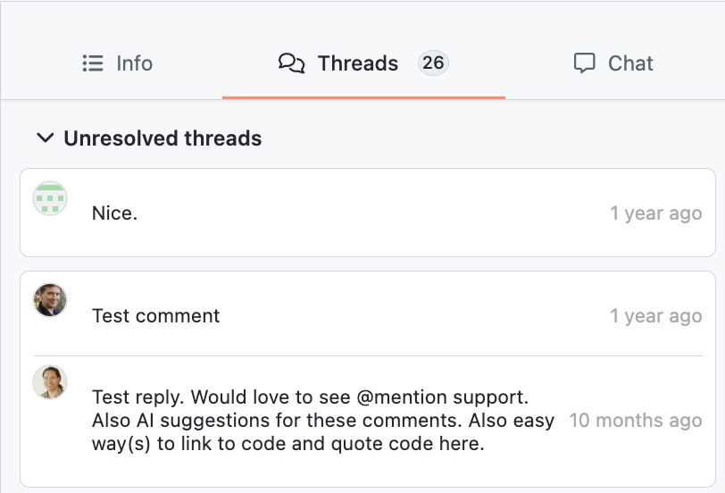

# Self Hosted Release Notes

---

## gitnotebooks/self-hosted:1.3.0

- **Features**
  - Added a file tree view to quickly hop from file to file
    
  - Added a threads list to the right panel so that you can quickly see all of the added comments in the pull request and navigate to them quickly 
  - The old dashboard has been replaced with a pull request inbox. From the inbox you can see all of the pull request that you care about, and customize which PRs are shown.
  - Added keyboard shortcuts to jump between files and diffs

---

## gitnotebooks/self-hosted:1.2.4

- **Bug Fixes**
  - Improved license check to reduce the amount of phone home requests made, and lessen the CPU usage for these license checks

---

## gitnotebooks/self-hosted:1.2.3

- **Bug Fixes**
  - Fixed an issue with reply comments. If someone replied to a comment within GitNotebooks on a file that's not a Jupyter Notebook, the parent comment's text would be used for the comment body rather than the comment typed out by the user.

---

## gitnotebooks/self-hosted:1.2.2

- **Features**
  - Added a new environment variable `USE_INITIALS_FOR_AVATARS`. When set to `true`, the app will not use GitHub avatars. Instead, it will create initials using the GitHub username and assign a randomized background color. This feature was added to address a [much](https://github.com/orgs/community/discussions/135891) [discussed](https://github.com/Reviewable/Reviewable/issues/770) shortcoming of the GitHub Enterprise Server API which breaks user avatar links.
    
- **Security**
  - Upgraded Next.js to `15.2.3` to patch a [middleware bypass vulnerability](https://nextjs.org/blog/cve-2025-29927). GitNotebooks was not affected by this vulnerability, but we may use middleware in the future.

---

## gitnotebooks/self-hosted:1.2.1

- **Features**
  - Bi-directional comment syncing between GitHub and GitNotebooks. If a comment is posted in GitNotebooks, it will be cross-posted to the corresponding JSON line in GitHub. If a comment is posted in GitHub, it will be shown in the corresponding rendered notebook line. Syncs comment edit and delete as well
  - Ability to "Add suggestion" to a notebook or code file and then apply the change within GitHub
  - Added a repo file explorer similar to a repo's home page in GitHub to allow notebook reviewers to quickly check python modules referenced from a notebook
  - Log more events and improved readability of server logs: `INFO`, `WARN`, `ERROR`, instead of `30`, `40`, `50`
  - View self hosted license information from the app home page: number of seats, expiration, license type
- **Bug Fixes**

  - File renames are now handled better. Comments used to disappear if they were posted to a renamed file and then a subsequent change was pushed to that notebook. This, and other edge cases related to rename behavior, has been fixed

> **Required Changes:** In order to upgrade to version 1.2.1 there are four requirements
>
> 1. Set a new environment variables `LICENSE_KEY`
> 2. Allow egress from the GitNotebooks service to https://license.gitnotebooks.com
> 3. Set the `GITHUB_BASE_URL` to the url of the GitHub API e.g. `https://api.github.com` for GitHub Enterprise Cloud. For GitHub Enterprise Server use `https://${CUSTOM_GITHUB_DOMAIN}/api/v3`
> 4. Modify the GitNotebooks GitHub App to subcribe to the following events
>    - Pull request review
>    - Pull request review comment
>    - Pull request review threadPull request thread comment
